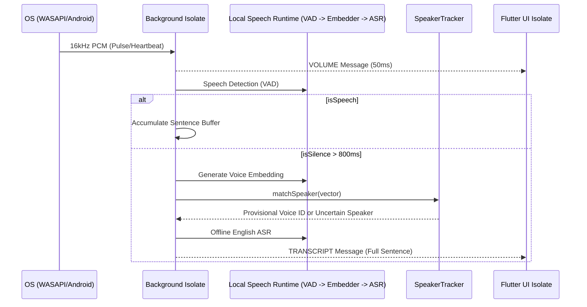
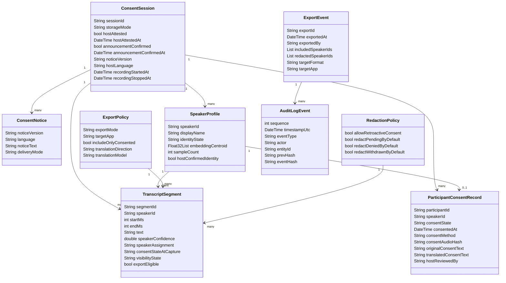

# Strategic Roadmap: VigyanTranscribe (Flutter Architecture)

This document defines the production architecture for the universal, local-first transcription system.

---

## 1. Architectural Paradigm: Decoupled IPC Model
The system employs a strict **Plugin/Plugout** strategy pattern with an Inter-Process Communication (IPC) boundary. The UI Isolate is entirely separated from heavy OS-level tasks.

### Core Architectural Decisions (Finalized)
1.  **Hybrid Capture Policy:** Loopback-first with runtime near-end probe and conditional mic assist; UI toggle is replaced by runtime status messaging.
2.  **Native Heartbeat:** Adapters emit contract-valid silent frames during capture starvation to maintain Dart pipeline stability.
3.  **Hardware-First Acceleration (Intel oneAPI SYCL):** 
    *   **Windows Intel:** Prioritize **Intel oneAPI SYCL** and **OpenVINO** for latest Gen 12+ hardware.
    *   **Generic Windows:** Fallback to **DirectML** for DX12 GPUs.
    *   **Apple Silicon:** **CoreML** for Neural Engine.
4.  **VAD-Driven SBD:** Mic-path offline ASR now uses an edge-triggered utterance segmenter with 300ms pre-roll, 400ms silence tolerance, 1200ms minimum utterance length, and 250ms tail overlap before flushing to STT. This is locked because raw VAD truth was clipping first syllables, over-flushing short phrases, and dropping boundary words under offline IndicConformer decode.

### Task 1 Decision Matrix

1. `preRollMs = 300`
   Why: recover clipped first syllables/phonemes at the moment VAD flips from silence to speech.
2. `silenceToleranceMs = 400`
   Why: prevent brief conversational pauses from ending the utterance too early and fragmenting offline ASR.
3. `minSegmentMs = 1200`
   Why: very short offline segments were producing blank, partial, or low-value IndicConformer results.
4. `tailOverlapMs = 250`
   Why: carry acoustic context across adjacent utterances and reduce word loss at speech-end boundaries without introducing excessive duplication.

### Four-Task Decision Matrix

1. `Task 1: Fix segmentation first`
   Why: offline IndicConformer quality was being limited by utterance boundary loss, short-fragment flushes, and clipped starts before diarization or loopback could be judged honestly.
2. `Task 2: Add speaker attribution only after Task 1 is stable`
   Why: unstable utterance segmentation creates speaker-vector churn, false speaker splits, and low-confidence attribution that hides the real ASR quality signal.
3. `Task 3: Add WASAPI loopback only after mic + segmentation + speaker path are proven`
   Why: loopback is a mixed render stream, so attribution confidence is weaker than near-end mic capture and should not be used to debug core ASR/segmentation defects.
4. `Task 4: Defer Android/M33 rollout constraints until Windows proof is stable`
   Why: Android has a different capture API surface (`AAudio` / `MediaProjection`), CPU-only inference assumptions, and model load-sequencing requirements that are important, but should not destabilize the current Windows-first validation lane.

### IPC Failure Root Cause

During live Windows validation, a separate control-path fault was identified that can mask capture/ASR issues:

1. the UI-side `LocalIpcTranscriptionService` considered itself connected after the initial WebSocket open
2. when the socket later closed, the backend correctly logged `UI WebSocket client disconnected`
3. but the UI did not clear its own connected state or reconnect before `START_MEETING`
4. result: the dashboard could still expose `Start Capture`, but the backend never received `_startCapture()`

Mitigation now locked:

1. UI IPC client must track real socket lifecycle, not just first-connect success
2. `onDone` / `onError` must mark the service disconnected
3. `startMeeting()` must ensure a live connection before sending `START_MEETING`
4. dashboard connection state must follow the IPC service’s real connection-state stream, not a stale local boolean
5.  **Current Offline Indic-First MVP:** LID is removed from the MVP hot path. The active Windows-first proof lane is microphone capture, VAD-aware utterance segmentation, and offline IndicConformer ASR. Speaker embeddings/diarization are intentionally deferred until segmentation and ASR stability are proven.
6.  **Speaker Tracking:** Voice embeddings + Weighted Moving Average live identification for provisional UI labels; offline diarization corrects final session output.
7.  **Uncertainty-Aware Identity:** Low-confidence, noisy, overlapping, or too-short segments are marked `Uncertain Speaker` instead of force-assigned.
8.  **Backend File Logging:** Engine logs to local file on Windows/Linux/macOS during development and testing; Android backend file logging remains disabled for now.
9.  **Debug WAV Validation Lane:** PCM/downsampling diagnostics must remain separate from the meeting path. A dedicated UI action can request a short canonical mic capture and write it to `logs/debug/*.wav` after native conversion so teams can listen to and offline-test the exact post-conversion waveform without involving VAD segmentation.
10. **Debug WAV UX Contract:** The debug recorder behaves as a mini-session rather than a fire-and-forget action. It exposes explicit Record/Stop control, reuses the same canonical mic bytesStream as the production lane, keeps the live volume gauge visible while recording, and attempts to flush a partial WAV on user stop so investigators can still inspect the captured waveform when the run is interrupted early.
11. **Native Format Diagnostics:** When debug WAV output sounds invalid, the next gate is native capture interpretation. The Windows capture layer now logs endpoint subtype interpretation (`ieee_float` vs `pcm`), `validBits`, and first-packet peak/RMS stats so bit-depth or container-format mismatches can be distinguished from later Dart-side VAD behavior.

## Native Capture Status (as of 2026-05-26)

Intel SST mic capture is unblocked. Resolved issues and locked decisions:

1. **DSP sleep fix**: WASAPI buffer duration reduced from 1s to 20ms. Intel SST DSP stays in sleep state with large buffers; 20ms forces it awake. Packets 1–3 remain near-zero (DSP startup); packets 4+ show live signal.
2. **DSP wake delay**: 200ms `Sleep()` + stat reset after `Start()` call. Allows DSP to stabilize before health logging begins.
3. **AudioCategory_Communications**: `IAudioClient2::SetClientProperties` with `AudioCategory_Communications` activates beamforming and AGC pipeline. Confirmed `hr=0x0`. Provides ~5–14x signal improvement on Intel SST.
4. **Anti-aliasing resampler**: Replaced naive linear interpolation with box-average filter (3 taps for 48k→16k). Root cause of grr/grinding noise: at step=3.0, interpolation fraction is always 0.0 — pure decimation with no filter, aliasing 8–24kHz content into voice band. Box-average zeros at 16kHz and 32kHz eliminate aliasing. WAV spectral analysis confirmed HP/LP ratio = 0.06x (noise eliminated).
5. **WASAPI flags for mic**: Changed from bare `0` to `AUDCLNT_STREAMFLAGS_AUTOCONVERTPCM | AUDCLNT_STREAMFLAGS_SRC_DEFAULT_QUALITY`. Windows handles format conversion and gain normalization internally. Loopback path unchanged.
6. **Gain and DC**: Manual `kMicGainFactor` (tested at 8.0) caused 18% clipping — removed. DC blocker (IIR high-pass, alpha=0.9999) added then removed — Windows AGC and Communications pipeline handles both. Do not re-add manual gain or DC correction.
7. **Bluetooth SCO noise**: Confirmed separate issue — HP OmniBook driver routes mic through Hands-Free Telephony profile when BT is connected, injecting SCO codec noise unrelated to WASAPI code. Fix: disable Hands-Free Telephony in Windows BT device settings.
8. **VadUtteranceSegmenter flushing fix**: Silence frames were not accumulated in utterance buffer during `flushing` state, cutting off trailing phonemes before ASR. Fixed: `_utteranceBuffer.addAll(frame)` added in flushing/silence branch. Three-state machine (silence → utteranceActive → flushing) preserved per pre-written contract tests.

## Continuation Plan

1. **Task 2: VAD Segmentation Validation** ← IMMEDIATE NEXT
   Run `flutter test test/vad_utterance_segmenter_test.dart` to confirm flushing fix. Speak 3 sentences in live app, verify all appear in transcript without missing words at boundaries.
2. **Task 3: Speaker Diarization**
   Wire pyannote segmentation and speaker embeddings after segmentation and ASR are stable.
3. **Task 4: Cross-Platform Audio Strategy**
   Extend `AudioCaptureStrategy` into a platform factory for Windows/Linux/macOS/Android.
4. **Task 5: Loopback and Source Tagging**
   After mic is proven per platform, expand loopback/source tagging using the same canonical 16kHz mono contract.

---

## 2. High-Level Design (HLD)

### System Sequence Diagram


---

## 3. Low-Level Design (LLD)

### Class Specification
*   **`SpeakerTracker`:** Manages an internal map of `VoiceID -> AverageVector`. Performs Cosine Similarity with a strict auto-assign threshold. Updates profiles using 90/10 weighted average to prevent drift.
*   **`LidClassifier`:** Diagnostic/advisory only. It is not part of the MVP real-time routing path.
*   **`OfflineDiarizer`:** Post-stop correction pass over the cached local recording. Produces final speaker segments and preserves uncertainty where speaker identity cannot be confidently assigned.
*   **`HardwareScanner`:** Probes `dxgi.dll` and `sysctl` to detect oneAPI SYCL/CoreML support.

---

## 4. Hardware Acceleration Roadmap
| Platform | Target Hardware | Primary Accelerator |
| :--- | :--- | :--- |
| **Windows (High-End)** | Intel Core Ultra / Arc | **oneAPI SYCL / OpenVINO** |
| **Windows (Generic)** | AMD / NVIDIA | **DirectML** |
| **macOS (M1+)** | Apple Silicon | **CoreML** |

---

## 5. Cross-Platform Testing Architecture

1. **Single Shell Pipeline:** `scripts/test_pipeline.sh` is the canonical automation entrypoint for local and CI.
2. **Fixture Contract:** Audio fixtures and path contracts are maintained under `test_fixtures/` (`sources.json`, `fixtures_manifest.json`, `paths.template.json`).
3. **Noise Simulation:** SNR-graded variants are generated via `scripts/generate_noisy_variants.py` per `NOISE_SIMULATION.md`.
4. **Model Presence Policy:** Full-mode tests ensure required models in `assets/models` using manifest-driven resolution and optional checksum verification.
5. **Windows Build Bridge:** Windows desktop builds from shell invoke `vcvars64.bat` through `scripts/build_windows_vcvars.sh` for deterministic C++ toolchain activation.
6. **HITL Separation:** Manual-only validations remain externalized in `HITL_TESTING.md` after automation passes.

---
*Updated 2026-05-26: Historical 2026-05-24 English-first note superseded for the current proof lane. LID remains removed from the hot path, but the active MVP proof is now Indic-first mic capture with VAD-aware segmentation and offline IndicConformer ASR; speaker attribution remains a later gate after ASR stability.*

## 6. Configurable Local Model Runtime

All model choices must be data-driven through a model registry/profile, not hardcoded into the background engine.

### Runtime Interfaces

```text
VadEngine
AsrEngine
SpeakerEmbeddingEngine
OfflineDiarizationEngine
TranslationEngine
ConsentWorkflowEngine
ExportPolicyEngine
```

### Model Profile Contract

```json
{
  "active_profile": "mvp_english_offline",
  "profiles": {
    "mvp_english_offline": {
      "vad": "sherpa_silero_vad",
      "asr": "sherpa_whisper_small_int8",
      "speaker_embedding": "sherpa_wespeaker_or_3dspeaker",
      "diarization": "sherpa_offline_diarization",
      "translation": null
    },
    "hindi_english_consent_experiment": {
      "vad": "sherpa_silero_vad",
      "asr": "meetsync_indic_conformer_onnx_sherpa_limited_languages",
      "speaker_embedding": "sherpa_wespeaker_or_3dspeaker",
      "diarization": "sherpa_offline_diarization",
      "translation": "indictrans2_indic_to_en_or_host_language"
    }
  }
}
```

Rules:
1. Sherpa-ONNX owns speech runtime tasks where supported: VAD, ASR, speaker embeddings, and offline diarization.
2. IndicTrans2 is text-to-text translation, not speech recognition, and should run behind `TranslationEngine` via ONNX Runtime/CTranslate2 or another local text runtime.
3. LID is diagnostic only for MVP; it must not decide the real-time route.
4. Model swaps must not require changes to capture, consent, export, or UI contracts.

---

## 7. DPDP-Oriented Domain UML



Separation rule:
1. `SpeakerProfile` is a probabilistic audio cluster.
2. `ParticipantConsentRecord` is deterministic host/participant metadata.
3. `TranscriptSegment` stores the consent state at capture time and export eligibility separately.
4. Legal identity must never be inferred solely from audio embeddings.

---

## 8. Consent, Quarantine, and Redaction State Model

Live transcription must continue when a new/late speaker appears. The system must not block the audio engine for late consent.

```text
pending/unknown speaker segment
  -> visibility_state = quarantined
  -> export_eligible = false

speaker later consented
  -> if allowRetroactiveConsent = true: prior quarantined segments may become visible/export_eligible
  -> audit event: retroactive_consent_applied

speaker denied/withdrawn
  -> prior and future segments redacted/excluded by default
  -> audit event: speaker_redacted
```

Default MVP policy:
1. Store pending segments locally in quarantine.
2. Do not export pending, denied, withdrawn, or unresolved segments by default.
3. Allow retroactive consent for prior pending segments only if host confirms and the event is audit logged.
4. Provide stricter enterprise mode where consent applies only from confirmation time forward.
5. WhatsApp/assistant handoff is explicit export only after the consent filter runs.

---

## 9. Python-to-C++ / DLL Conversion Methodology

Most Hugging Face examples are Python-first. Before converting any model into the native DLL path, agents must document and validate the full model contract.

### Required Conversion Checklist

1. Identify model task: ASR, speaker embedding, diarization, translation, VAD, or diagnostic LID.
2. Record license, source repository, model version, and whether weights are gated.
3. Capture input contract: sample rate, channels, waveform normalization, tokenizer files, text normalization, tensor names, tensor ranks, and dynamic axes.
4. Capture output contract: logits/IDs/text/embeddings, decoding rules, timestamps, confidence fields, and postprocessing.
5. Reproduce Python reference inference on canonical fixtures.
6. Export or obtain ONNX/CT2/Sherpa-compatible assets.
7. Validate native inference output against Python reference within acceptable tolerance.
8. Wrap only task-level APIs in C++/DLL; never expose raw tensor details to Dart UI code.
9. Add fixture tests for the native wrapper before using it in the live engine.
10. Record model profile entry and release checklist evidence.

### Native Boundary Target

```text
vigyan_audio_engine.dll
  capture_start / capture_stop
  push_audio_frame
  vad_detect
  asr_decode
  speaker_embed
  diarize_offline
  translate_text
  export_session
```

Dart/Flutter must communicate with task-level objects and IPC messages, not direct tensor operations.

---
*Updated 2026-05-24: Added configurable model runtime, DPDP UML, quarantine/redaction model, and Python-to-C++ conversion methodology.*

## 10. Future Optimization Strategy (Post Flutter Transcription Proof)

This section is explicitly post-MVP. Do not block the current Flutter transcription stabilization on these items.

### Runtime Split

```text
Audio lane:
  Sherpa-ONNX
    -> VAD
    -> ASR where model layout is supported
    -> speaker embeddings
    -> offline diarization

Translation lane:
  ONNX Runtime or CTranslate2
    -> IndicTrans2 text-to-text translation
    -> runs in a separate translation isolate

Conversion lane:
  VVC Docker / RTX 5090
    -> NeMo / Hugging Face Optimum / CTranslate2 tooling
    -> exports ONNX/CT2/INT8 assets
```

Rules:
1. Sherpa-ONNX is the speech/audio runtime path, not a text translation runtime.
2. IndicTrans2 is text-to-text and must not run in the audio isolate.
3. IndicTrans2 should translate only consented/export-eligible transcript content by default.
4. Translation export must be explicit and audit logged.
5. Do not claim DPDP compliance; use `DPDP-aligned local-first architecture pending legal validation`.

### IndicConformer 600M Strategy

1. Use the AI4Bharat/NeMo stack in Docker to export future IndicConformer 600M ASR assets.
2. Test whether the exported graph matches Sherpa-supported ASR layouts.
3. If compatible, expose it through a Sherpa-backed `AsrEngine` profile.
4. If not compatible, wrap it behind a custom native ONNX Runtime `AsrEngine`.
5. The meetsync IndicConformer Sherpa export is only a limited-language proof candidate, not the final India-wide ASR solution.

### IndicTrans2 Strategy

1. Test both runtime paths before committing:
   - Optimum ONNX -> ONNX Runtime
   - CTranslate2 conversion -> CTranslate2 runtime
2. Validate tokenization and IndicTransToolkit preprocessing against Python reference outputs.
3. Use separate quantization/runtime profiles for Windows x64/AVX2 and ARM64/mobile; do not use one quantization config for all targets.
4. Treat short consent snippets and final consented transcript export as the first translation workloads.
5. Translation output is advisory for host review/export; it does not replace the consent ledger.

### Activation Criteria

Only begin this optimization track after:
1. Flutter loopback capture is stable.
2. Canonical PCM contract is proven.
3. Sherpa VAD/speaker embedding smoke tests pass.
4. English ASR proof works locally.
5. Consent ledger, quarantine, and export-redaction rules are implemented and tested.

## 11. Next Session Note: Sherpa Input Contract And WASAPI Resampling

The following points are locked for the next implementation session.

1. Sherpa-ONNX speech models expect canonical `16000 Hz`, `mono`, `Float32` PCM at the model boundary.
2. Native adapters own sample-rate conversion and normalization. Dart/UI code must not own production resampling logic.
3. First ask the OS/native capture layer for `16000 Hz` directly where the platform supports it.
4. Windows WASAPI loopback is the known exception: it usually yields the system output rate (commonly `48000 Hz`) and cannot be treated as guaranteed `16000 Hz` input.
5. If loopback capture rate is not `16000 Hz`, route it through a native resampler before handing frames to Sherpa or any other speech model.
6. Do not use naive Dart downsampling by dropping every third sample for `48000 -> 16000`. That is only a throwaway prototype hack and is not acceptable for production-quality ASR, speaker embedding, or diarization.
7. Preferred production order:
   - request `16000 Hz` from OS/native driver
   - if not available, use native/OS resampler in C++
   - only use app-level software resampling as a last-resort fallback
8. No FFmpeg is required in the live capture path; the runtime consumes canonical PCM, not containerized media.
9. Before testing Dolphin or any other Sherpa ASR model, verify and log actual incoming sample rate from the capture plugin.
10. The real test objective is not just `Dolphin works`; it is `WASAPI loopback -> native resampler -> canonical PCM -> Sherpa` works without heartbeat corruption, starvation stalls, or speaker-vector drift.

## 12. Conversion-First Capture And ASR Mode Split

The capture boundary and the ASR boundary are now treated as separate strategy seams.

1. `AudioCaptureStrategy` owns device negotiation and emits only canonical `16 kHz mono` PCM into the engine.
2. Platform-native code owns device-format adaptation first. This includes `44.1 kHz`/`48 kHz` handling, channel fold-down, and heartbeat-safe packet continuity.
3. `AsrEngine` owns speech runtime selection on top of canonical audio:
   - `MeetsyncIndicOfflineAsrEngine` as the active Sherpa VAD-triggered proof target
   - `DolphinOnlineAsrEngine` remains a parked single-graph CTC experiment
   - `IndicTransducerAsrEngine` remains the generic future transducer placeholder
4. The engine must not push device-native `48 kHz stereo` deeper into VAD, speaker embedding, or ASR code.
5. UX does not need a new dedicated panel for the first spike. Existing engine/model status surfaces are sufficient to expose the active ASR profile during testing.

Implication:
`device/native format -> native conversion/resample once -> canonical 16 kHz mono -> selected ASR topology strategy`

Future Indic routing note:
1. Do not use Whisper-based LID for the long-term India strategy in this repo.
2. Prefer Meta MMS-LID as the language gatekeeper once multilingual routing begins.
3. The future path is:
   - canonical `16 kHz mono` capture
   - short initial buffer for MMS-LID
   - dispose gatekeeper if needed
   - dynamically load the target monolingual/transducer Sherpa model
   - continue online recognition with the same waveform contract
4. This routing strategy is future work. It must not block the immediate meetsync offline proof.

Current proof update:
1. The immediate live test target is now `meetsync/indic-conformer-onnx-sherpa`, not Dolphin.
2. The engine downloads `model.int8.onnx` and `tokens.txt` on first run if missing.
3. The current working path is:
   - WASAPI/native capture
   - native format adaptation to canonical `16 kHz mono`
   - existing VAD/sentence segmentation
   - Sherpa `OfflineRecognizer` with `OfflineNemoEncDecCtcModelConfig`
4. The `meetsync` model card’s online snippet is not a drop-in fit for the current Sherpa Windows runtime path; the offline NeMo CTC lane is the validated proof path for now.
5. For the current offline proof, long continuous loopback speech/music should not wait for full natural silence; the engine may force-flush shorter segments to keep transcript feedback visible during validation.

## 13. Deferred Android M33 Constraints

This note is architectural only for now. It is not yet an implementation task.

### Exynos 1280 / M33 Runtime Assumptions

1. ONNX inference is treated as CPU-only on this target. Do not assume NPU, GPU delegate, QNN, or other accelerator support in the first Android rollout.
2. Expected per-stage latency is acceptable for turn-based offline speech:
   - IndicConformer INT8 on CPU: roughly `200-400 ms` per segment
   - speaker embedding: roughly `50 ms`
   - pyannote segmentation: roughly `100 ms`
   - total post-VAD latency target: roughly `400-600 ms`
3. This target is inference-only. Do not plan any on-device training.
4. Do not plan real-time source separation or simultaneous `mic + loopback + ASR + LLM` on this class of device.

### Memory Sequencing Policy

1. Always-on models:
   - Silero VAD
   - speaker embedding
   - pyannote segmentation
2. Load on speech:
   - IndicConformer INT8 ASR
3. Load only when needed, then release:
   - VITS TTS
4. The Android target must avoid loading the full future speech stack permanently in RAM.

### Android Capture Equivalents

1. `AAudio` is the near-end microphone capture path.
2. `MediaProjection` is the Android system-audio/loopback analogue to Windows WASAPI loopback.
3. MediaProjection requires explicit user permission and should be treated as the enterprise-acceptable loopback path on Android.

### Carry-Forward From Windows

1. The same canonical model boundary still applies: `16 kHz mono Float32`.
2. The same `VadUtteranceSegmenter` strategy carries forward unchanged in concept.
3. The same Sherpa/ONNX model assets can be reused, but Android rollout must apply stricter load sequencing and CPU-budget discipline than Windows.
