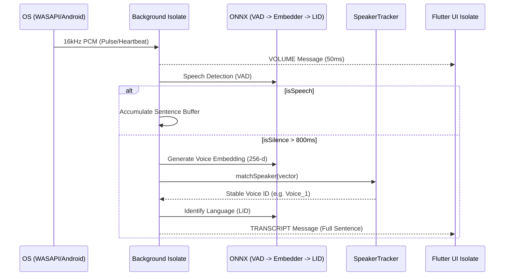

# Strategic Roadmap: VigyanTranscribe (Flutter Architecture)

This document defines the production architecture for the universal, local-first transcription system.

---

## 1. Architectural Paradigm: Decoupled IPC Model
The system employs a strict **Plugin/Plugout** strategy pattern with an Inter-Process Communication (IPC) boundary. The UI Isolate is entirely separated from heavy OS-level tasks.

### Core Architectural Decisions (Finalized)
1.  **Hybrid Capture Policy:** Loopback-first with runtime near-end probe and conditional mic assist; UI toggle is replaced by runtime status messaging.
2.  **Native Heartbeat:** Adapters emit contract-valid silent frames during capture starvation to maintain Dart pipeline stability.
3.  **Hardware-First Acceleration (Intel oneAPI SYCL):** 
    *   **Windows Intel:** Prioritize **Intel oneAPI SYCL** and **OpenVINO** for latest Gen 12+ hardware.
    *   **Generic Windows:** Fallback to **DirectML** for DX12 GPUs.
    *   **Apple Silicon:** **CoreML** for Neural Engine.
4.  **VAD-Driven SBD:** Sentence Boundary Detection (SBD) waits for a 800ms natural pause before flushing to STT.
5.  **Speaker Tracking:** 256-d Voice Embeddings (`wespeaker`) + Weighted Moving Average Diarization to ensure consistency.
6.  **Backend File Logging:** Engine logs to local file on Windows/Linux/macOS during development and testing; Android backend file logging remains disabled for now.

---

## 2. High-Level Design (HLD)

### System Sequence Diagram

---

## 3. Low-Level Design (LLD)

### Class Specification
*   **`SpeakerTracker`:** Manages an internal map of `VoiceID -> AverageVector`. Performs Cosine Similarity with a 0.82 threshold. Updates profiles using 90/10 weighted average to prevent drift.
*   **`LidClassifier`:** Uses Meta MMS-LID-126 with a static mapping for high-precision identification (HIN/TAM/ENG/TEL).
*   **`HardwareScanner`:** Probes `dxgi.dll` and `sysctl` to detect oneAPI SYCL/CoreML support.

---

## 4. Hardware Acceleration Roadmap
| Platform | Target Hardware | Primary Accelerator |
| :--- | :--- | :--- |
| **Windows (High-End)** | Intel Core Ultra / Arc | **oneAPI SYCL / OpenVINO** |
| **Windows (Generic)** | AMD / NVIDIA | **DirectML** |
| **macOS (M1+)** | Apple Silicon | **CoreML** |

---

## 5. Cross-Platform Testing Architecture

1. **Single Shell Pipeline:** `scripts/test_pipeline.sh` is the canonical automation entrypoint for local and CI.
2. **Fixture Contract:** Audio fixtures and path contracts are maintained under `test_fixtures/` (`sources.json`, `fixtures_manifest.json`, `paths.template.json`).
3. **Noise Simulation:** SNR-graded variants are generated via `scripts/generate_noisy_variants.py` per `NOISE_SIMULATION.md`.
4. **Model Presence Policy:** Full-mode tests ensure required models in `assets/models` using manifest-driven resolution and optional checksum verification.
5. **Windows Build Bridge:** Windows desktop builds from shell invoke `vcvars64.bat` through `scripts/build_windows_vcvars.sh` for deterministic C++ toolchain activation.
6. **HITL Separation:** Manual-only validations remain externalized in `HITL_TESTING.md` after automation passes.

---
*Updated 2026-05-22: oneAPI SYCL & Weighted Diarization Pivot*
