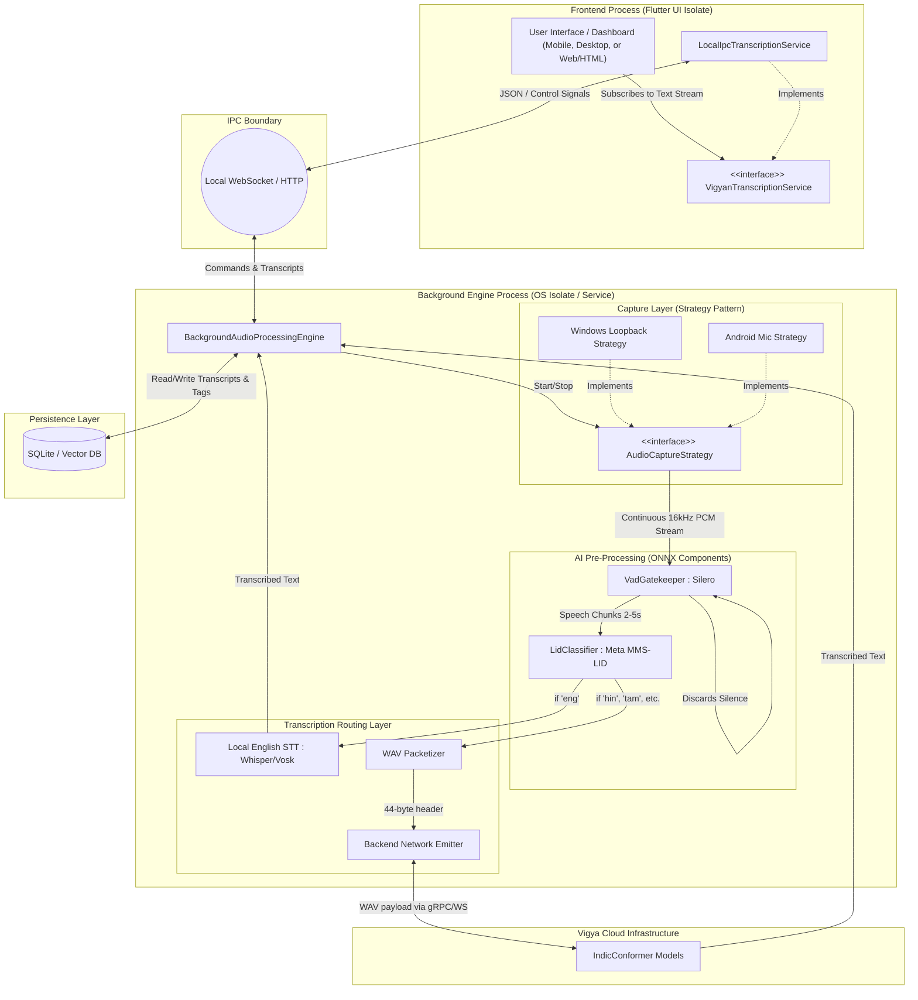
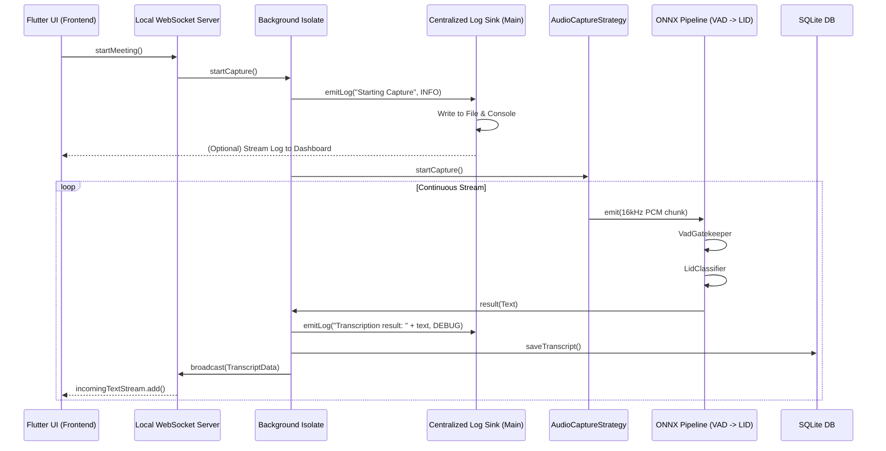
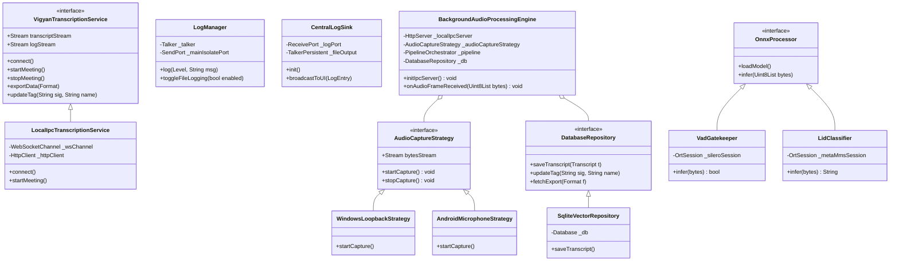

# Strategic Roadmap: TurboTranscribe (Flutter Architecture)

This document outlines the phased development plan for the high-performance, object-oriented transcription system, moving from the Node.js PoC to a production-ready, cross-platform Flutter application.

---

## 1. Architectural Paradigm: Decoupled IPC Model
To support constrained Android devices and powerful Core Ultra 9 laptops simultaneously, the system employs a strict **Plugin/Plugout** strategy pattern with an Inter-Process Communication (IPC) boundary.

### Architecture Diagram

### High-Level Design (HLD): System Boundaries & Data Flow
The HLD establishes the macro-level interactions between the client, the local engine, and remote services.

### Low-Level Design (LLD): Class Architecture
The LLD defines the specific Dart interfaces, abstract classes, and concrete implementations that enable the plug-and-play strategy pattern.

### The UI Boundary (Frontend Isolate)
- `VigyanTranscriptionService`: An interface defining streams (`incomingTextStream`) and controls.
- `LocalIpcTranscriptionService`: The concrete implementation that connects to the background engine via `localhost` (HTTP/WS), entirely decoupled from native audio libraries.
- **UI Capabilities**:
    - **Live Transcript Show**: Real-time scrolling display of the active meeting.
    - **Accumulation & Append**: Seamless merging of incoming text chunks.
    - **Speaker Diarization**: Real-time display of "Voice Signatures".
    - **Dynamic Tagging**: Frontend tagging (e.g., "Voice 1" -> "John") immediately sent to the backend for persistent storage.
    - **Export Options**: Download functionality for SRT, JSON, and TXT formats, fetched directly from the backend persistence layer.

### The OS Boundary (Background Engine Isolate)
- `BackgroundAudioProcessingEngine`: A headless HTTP/WS server running in a separate Dart Isolate (or native service). It orchestrates the audio pipeline without blocking the UI thread.
- **Persistence**: Replaces flat JSON files with a local **SQLite Database**. Designed with an abstraction layer to support future vector extensions (e.g., `sqlite-vss`) for semantic search capabilities.
- **Strategy Pattern (Audio Capture)**:
    - `WindowsLoopbackStrategy`: Hooks into WASAPI via FFI.
    - `AndroidMicrophoneStrategy`: Hooks into `AudioRecord` via Platform Channels.
- **Component Pattern (ONNX Processors)**:
    - `VadGatekeeper`: Uses Silero VAD. Evaluates 30ms micro-buffers to reject silence and slice the stream into conversational phrases (typically 2-5 seconds).
    - `LidClassifier`: Uses **Meta's MMS-LID (ONNX Quantized)**. Evaluates the phrase chunk. Runs in <50ms with a tiny memory footprint.
    - `Routing Logic`:
        - If MMS-LID returns `'eng'`: Route chunk to Local English STT (e.g., Vosk or Whisper Turbo forced to English).
        - If MMS-LID returns `'hin'`, `'tam'`, etc.: Route chunk to Custom Network Emitter.
- **Network Emitter**: Packages non-English PCM into canonical `.wav` buffers (44-byte headers) and pushes them via WebSocket/gRPC to the Vigya Cloud (IndicConformer).

---

## 2. Implementation Roadmap

### Phase 1: Engine Isolation & Data Modeling
**Target**: Implement the abstract interfaces, the IPC loopback server, and the database.
- Set up the Flutter project structure.
- Define `AudioCaptureStrategy` and `OnnxProcessor` interfaces.
- Create the `BackgroundAudioProcessingEngine` Isolate with a local WebSocket server.
- Implement the **SQLite** schema for storing transcripts, timestamps, and voice signatures.

### Phase 2: Windows Migration & CI/CD Setup
**Target**: Re-establish Windows capture and automated build pipelines.
- Implement `WindowsLoopbackStrategy` (using dart:ffi or a native plugin).
- Implement the `LocalIpcTranscriptionService` in the UI to visualize the audio flow, handle tagging, and process exports.
- **CI/CD**: Create separate workflow stubs (e.g., GitHub Actions) for Windows `.exe` and Android `.apk` builds.

### Phase 3: The "Vigya-Modular" Pipeline (VAD & LID)
**Target**: Add intelligence to the audio stream.
- Integrate `VadGatekeeper` (Silero ONNX) to chunk audio.
- Integrate `LidClassifier` to route chunks.
- Implement the WAV Packetizer for the `BackendNetworkEmitter`.

### Phase 4: Android Port & Mobile Strategies
**Target**: Cross-platform execution.
- Implement `AndroidMicrophoneStrategy`.
- Optimize ONNX execution for mobile NPUs (TensorFlow Lite or ONNX Runtime Mobile).

---

## 3. Technical Stack Summary
| Component | Platform | Technology |
| :--- | :--- | :--- |
| **Application Shell** | Windows / Android | Flutter / Dart |
| **Architecture** | Universal | Interface-Driven, Dependency Injection |
| **Concurrency** | Universal | Dart Isolates / Background Services |
| **Audio Capture** | Windows | FFI -> WASAPI / Core Audio |
| **Audio Capture** | Android | Platform Channels -> AudioRecord |
| **AI Processing** | Universal | ONNX Runtime (Mobile/Web wrappers) |
| **Network Protocol** | Universal | WebSocket / gRPC (WAV payload) |

---
*Generated for Architectural Continuity*
